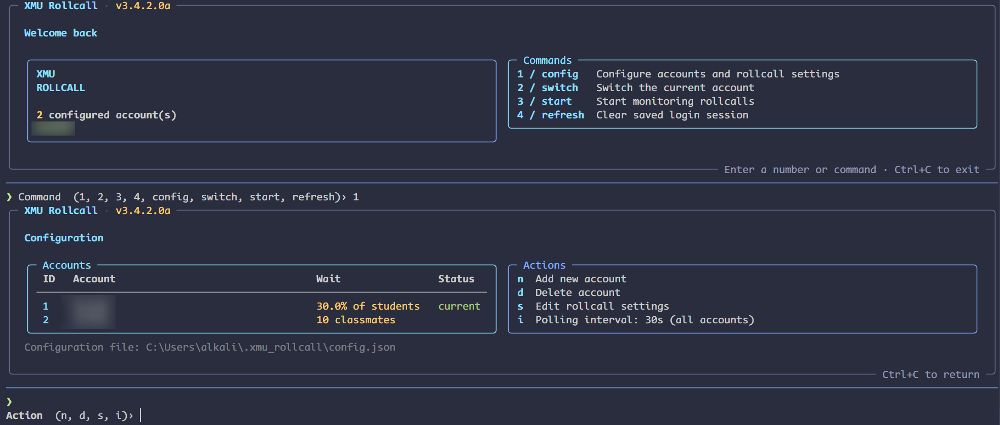
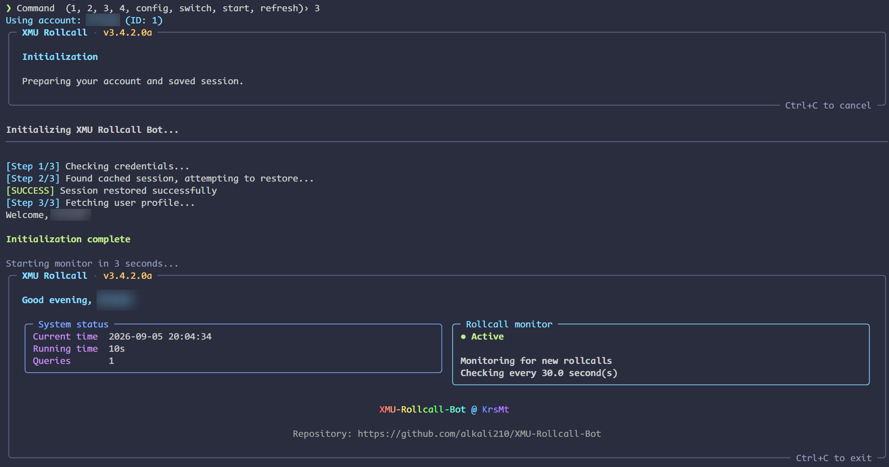

# XMU Rollcall Bot

[English](README-en.md) | **简体中文**

> 本项目 fork 自 [KrsMt-0113/XMU-Rollcall-Bot](https://github.com/KrsMt-0113/XMU-Rollcall-Bot)，并基于其 3.4.1 版本进行开发。

厦门大学（Tronclass）自动签到程序，**仅供学习研究使用**

## 概览

- 实时监控签到状态，支持设置监控间隔
- 自动完成签到：
  - 数字签到：从 API 获取数字码
  - 雷达签到：使用两个位置点求解签到位置
- 支持提交签到前按比例或人数等待
- 支持多账号，并在 SQLite 中加密存储账号信息和会话
- 在日志文件中记录签到状态
- 更友好的交互界面

<details>
<summary>运行截图</summary>

<br><br>

</details>

## 安装

### Windows EXE

从 [Releases](https://github.com/alkali210/XMU-Rollcall-Bot/releases) 下载 `exe`，例如 `xmu-rollcall-3.5.0.0.exe`。双击进入交互菜单，无需安装 Python。

### 从源码安装

clone 本仓库并进入 `xmu-rollcall-cli/`：

```bash
git clone --depth 1 https://github.com/alkali210/XMU-Rollcall-Bot.git
cd XMU-Rollcall-Bot/xmu-rollcall-cli
```

#### 虚拟环境

```bash
uv sync
```

#### 全局安装

```bash
pip install -e .
```

## 使用

不带参数运行 `xmu-rollcall`，或者双击 `exe` 即可进入交互菜单，按 `Ctrl+C` 退出。

命令行参数：

```bash
xmu-rollcall config  # 配置账号，支持多账号
xmu-rollcall switch  # 切换账号
xmu-rollcall start   # 启动监控
xmu-rollcall refresh # 刷新登录状态
xmu-rollcall --help  # 查看帮助

uv run xmu-rollcall [option] # 如果使用 uv
```

在交互界面中，可以随时按 `Ctrl+C` 退出或者回到主菜单。

日志文件位于配置目录内的 `xmu_rollcall.log`。

> 目前无法处理二维码签到，检测到二维码签到时，监控程序将暂停 5 分钟，以防止短时间内重复请求。

## 配置

可以直接在 TUI 中配置，在初次使用时需要新建账号并输入学号密码登录。

配置目录优先使用环境变量 `XMU_ROLLCALL_CONFIG_DIR`，否则使用 `~/.xmu_rollcall`；用户目录不可写时使用当前目录下的 `.xmu_rollcall`。

配置文件示例：

```jsonc
{
  "interval": 15,
  "current_account_id": 1,
  "accounts": [
    {
      "id": 1,
      "rollcall_settings": {
        "wait_before_answer": 5
      }
    },
    {
      "id": 2,
      "rollcall_settings": {
        "wait_before_answer": false
      }
    }
  ]
}
```

### 监控间隔

在配置菜单中按 `i` 设置监控间隔，对所有账号生效（默认：10 秒，支持正数秒值）。也可以直接编辑 `config.json`，下次启动监控时生效。

### 等待同学签到

在配置菜单中按 `s`，设置提交签到前的等待，正整数表示提交前等待的已签到人数，百分比表示提交前等待的人数比例，`false` 表示不等待，默认值为 `10%`。
